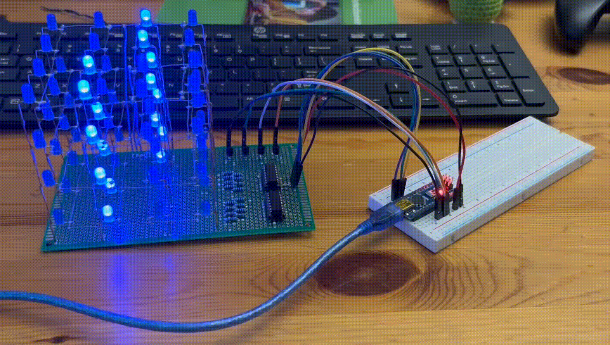

# 4×4×4 Blue LED Cube

A 4×4×4 LED cube controlled by an Arduino using transistors and multiplexing, achieving flicker-free animation at 250 Hz with a 25% refresh rate. This project demonstrates circuit design, embedded programming, and PCB layout skills using KiCad.

## Overview
This project includes:
- Circuit schematic and PCB layout designed in KiCad
- Transistor-based control logic for efficient multiplexing
- Breadboard prototype and final soldered cube
- Modular design enabling microcontroller swaps and future feature expansion

## Features
- Flicker-free LED animation at **250 Hz**
- Power-efficient design using transistors and multiplexing
- Modular perfboard design for easy maintenance and upgrades
- Interactive features using ESP32 microcontroller

## Tools & Technologies
- **Hardware:** Arduino, 64x LEDs, 16x 470 ohm resistors, 4x transistors, 2x 74HC595 shift registers, perfboard
- **Software:** KiCad, Arduino IDE, C++
- **Other:** Breadboard prototyping, soldering

## Project Structure
- **Columns:** Each of the 16 LED columns shares a common anode, each connected to a pin on a 74HC595 shift register.
- **Layers:** Each of the 4 layers shares a common cathode, controlled by transistors to select which layer is grounded.
- **Control:** Arduino pins drive the shift registers and transistors to create multiplexed animation.
